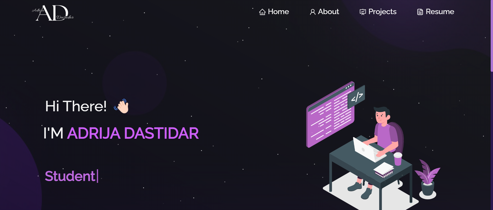
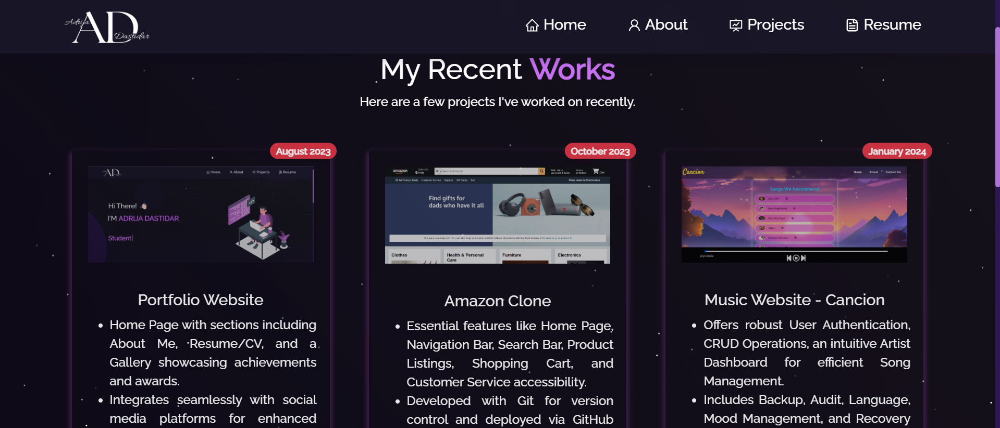

# Portfolio Website

## Overview

This portfolio website showcases my professional profile and achievements. It features a Home Page with sections including **About Me**, **Resume/CV**, and **Projects** highlighting my work. The website also integrates seamlessly with social media platforms for enhanced connectivity.

Link - [Portfolio Website](https://adrijadastidar.github.io/Portfolio/)

## Features

- **About Me:** A detailed section about my professional background, skills, and personal interests.
- **Resume/CV:** An easily accessible and downloadable version of my resume/CV.
- **Project:** A visual display of my achievements and awards.
- **Social Media Integration:** Seamless links to my social media profiles for enhanced connectivity.
- **Responsive Design:** Optimized for viewing on both desktop and mobile devices.

## Technologies Used

- React
- React Bootstrap (for styling)
- GitHub Pages (for deployment)

## Screenshots

## Acknowledgements

This project is a culmination of my professional journey and technical expertise. Special thanks to all who have supported and inspired me throughout my career.

## Contact

For any inquiries or feedback, please contact me at **adrijadastidar@gmail.com**.

## Contributing

Contributions are welcome! If you have any suggestions, feature requests, or find any issues, please create a GitHub issue or submit a pull request.
